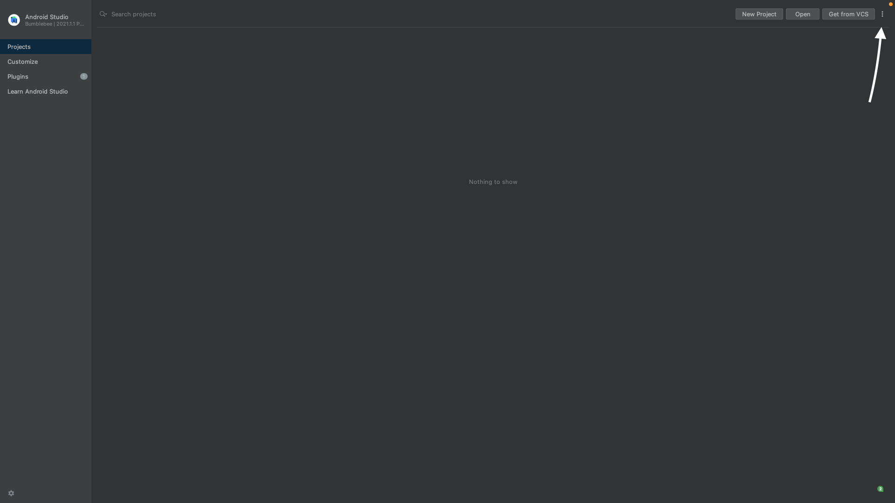

# Rage Chat

1. When you have cloned the project, run `npm install` from the root folder and then `cd ios && pod install` to install the dependencies.

2. Make a .env file in the root folder and copy the example from .env.example. Then insert the WEB_CLIENT_ID provided in the mail.

   > example: `WEB_CLIENT_ID=id`

3. To start the metro server run `npm start` in the terminal.

4. IOS: After step 3 open a new terminal and run `npm run ios`

5. ANDROID: Make sure to have an emulator ready. Then run `npm run android` in the new terminal.

# Troubleshooting
## Android emulator won't connect
1.Turn off the emulator

2.Open Android studio click on the three dots:
        

3. Then click "Virtual device manager"
    - After that a small window should open. 

4. Click the arrow down icon under actions

5. Then click wipe data.

6. Then open click the play button and wait for the emulator to turn.

7. Then run `npm run android` in the terminal